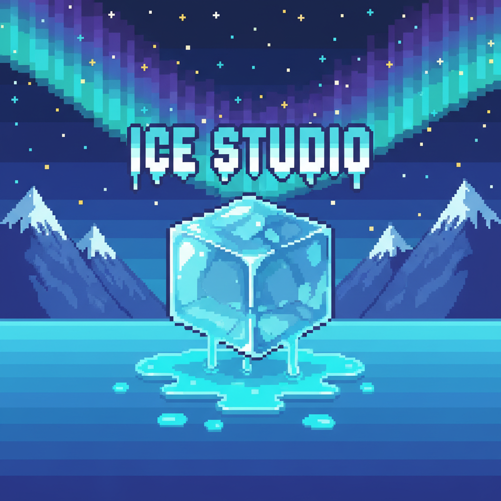

<p align="center">
  
</p>

<h1 align="center">❄️ Ice Golem Adventure ❄️</h1>

<p align="center">
  <em>Un jeu vidéo 2D éducatif pour sensibiliser les enfants au réchauffement climatique</em>
</p>

<p align="center">
  
  

  
  
</p>

---

## 📖 Description

**Ice Golem Adventure** est un jeu vidéo 2D éducatif développé en **Python** avec **Pygame**, conçu pour **sensibiliser les enfants de 9 à 10 ans** aux enjeux du réchauffement climatique à travers une aventure interactive et captivante.

> 🌍 Les enfants passent plus de 2 h/jour sur des écrans, mais manquent d'éducation ludique sur la pollution et le climat. **Ice Golem Adventure** transforme l'apprentissage climatique en une expérience de jeu immersive et amusante.

---

## 🧊 L'Histoire

Dans un monde ravagé par la pollution, le **Docteur Snow** avait mis au point une machine révolutionnaire capable de stopper le réchauffement climatique. Mais **Smog**, une terrifiante entité vivante faite de pollution, l'a éliminé avant qu'il ne puisse achever son œuvre.

Sa dernière création ? **Imir**, un petit golem de glace inachevé, qui se réveille seul dans les ruines du laboratoire… C'est au joueur de guider Imir à travers trois niveaux périlleux pour vaincre Smog et sauver la planète ! 🌎

### 👾 Personnages

| Personnage | Rôle | Description |
|:---:|:---:|:---|
| **Imir** | 🦸 Héros | Petit golem de glace inachevé, dernière création du Docteur Snow |
| **Docteur Snow** | 🧪 Mentor (décédé) | Scientifique brillant, créateur de la machine anti-réchauffement |
| **Smog** | 💀 Antagoniste | Entité vivante faite de pollution — Boss final du jeu |

---

## 🗺️ Structure des niveaux

### 🏚️ Niveau 1 — Le Parcours *(vue de côté / platformer)*
> Imir traverse les ruines du laboratoire du Docteur Snow. Il doit éviter les obstacles et la lave grâce à des sauts précis et une bonne gestion de la gravité.
>
> 🎯 **Compétence éducative :** précision et patience

### 🏰 Niveau 2 — Le Château *(vue de dessus / puzzle)*
> Le joueur déplace Imir à travers le château et doit résoudre des énigmes impliquant le placement stratégique de statues sur des cibles pour débloquer la suite.
>
> 🎯 **Compétence éducative :** réflexion spatiale, anticipation et résolution de problèmes

### ⚔️ Niveau 3 — Le Combat Final *(arène ouverte / boss fight)*
> Affrontement final contre **Smog** et sa horde de monstres ! Dans une arène, le joueur doit esquiver les attaques, gérer ses lancers de boules de neige et frapper au corps à corps.
>
> 🎯 **Compétence éducative :** gestion de l'espace, réflexes et stratégie de combat

---

## 🚀 Installation et lancement

### Prérequis

- **Python 3.x** — [Télécharger ici](https://www.python.org/downloads/)
- **Pygame** — Bibliothèque graphique 2D

### Étapes d'installation

1. **Cloner le dépôt**
   ```bash
   git clone https://github.com/votre-utilisateur/Ice_Golem_Adventure.git
   cd Ice_Golem_Adventure
   ```

2. **Créer un environnement virtuel** *(recommandé)*
   ```bash
   python -m venv .venv
   ```
   - Windows : `.venv\Scripts\activate`
   - macOS / Linux : `source .venv/bin/activate`

3. **Installer les dépendances**
   ```bash
   pip install pygame
   ```

4. **Lancer le jeu** 🎮
   ```bash
   python main.py
   ```

---

## 📂 Arborescence du projet

```
Ice_Golem_Adventure/
│
├── main.py                  # 🎬 Point d'entrée du jeu
│
├── entities/                # 👾 Entités du jeu
│   ├── constante.py         #    Constantes globales (résolution, physique, vitesses…)
│   ├── monster.py           #    Ennemis de base du jeu
│   ├── platform_sol.py      #    Plateformes et sols
│   ├── player_side.py       #    Joueur — vue de côté (platformer)
│   ├── player_top.py        #    Joueur — vue de dessus (puzzle)
│   └── statue.py            #    Mécanique de poussée des statues
│
├── scenes/                  # 🎭 Scènes du jeu
│   ├── cutscene.py          #    Cinématiques (logo, intro, game over…)
│   ├── game_over.py         #    Écran de fin de partie
│   ├── level1.py            #    Niveau 1 — Le Parcours
│   ├── level2.py            #    Niveau 2 — Le Château
│   ├── level3.py            #    Niveau 3 — Le Combat Final
│   └── menu.py              #    Menu principal + paramètres
│
├── utils/                   # 🔧 Utilitaires
│   └── physics.py           #    Moteur physique (gravité, collisions)
│
├── assets/                  # 🎨 Ressources graphiques et audio
│   ├── audio/               #    Musiques et effets sonores
│   ├── backgrounds/         #    Fonds d'écran (menu, niveaux, cinématiques)
│   ├── maps/                #    Cartes des niveaux (.tmx) et tilesets (.tsx)
│   ├── sprites/             #    Sprites des personnages (golem, ennemis, boss)
│   └── ui/                  #    Éléments d'interface utilisateur (boutons, logos)
│
├── .gitignore               # Fichiers ignorés par Git
├── projet.md                # Résumé du projet
└── README.md                # 📄 Ce fichier
```

---


## 👥 L'Équipe — Ice Studio

| 👤 Membre | 📧 Email |
|:---|:---|
| **Laurent** | laurent.yoganathan@efrei.net |
| **Mathieu** | mathieu.singpraseuth@efrei.net |
| **Parker** | hans.mendo@efrei.net |
| **Stéfen** | stefen.stalin@efrei.net |
| **Romain** | romain.pinard@efrei.net |

---

## 🎓 Contexte scolaire

Ce projet a été développé dans le cadre de la **prépa intégrée de l'EFREI Paris**, une grande école d'ingénieurs du numérique.

Il s'inscrit dans une démarche pédagogique visant à :
- 🛠️ Mettre en pratique les compétences de **programmation Python**
- 🎮 Concevoir un **produit interactif** de A à Z (game design, développement, assets)
- 🌱 Sensibiliser à une **cause environnementale** à travers le jeu vidéo
- 👥 Travailler en **équipe** sur un projet d'envergure

---

## 📚 Ressources et documentation

- 🐍 [Documentation officielle Python](https://docs.python.org/fr/3/)
- 🎮 [Documentation officielle Pygame](https://www.pygame.org/docs/)
- 🗺️ [Tiled Map Editor](https://www.mapeditor.org/) — Utilisé pour la création des cartes

---


<p align="center">
  Développé avec ❄️ et ❤️ par <strong>Ice Studio</strong> — EFREI Paris 2026
</p>